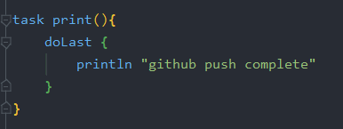
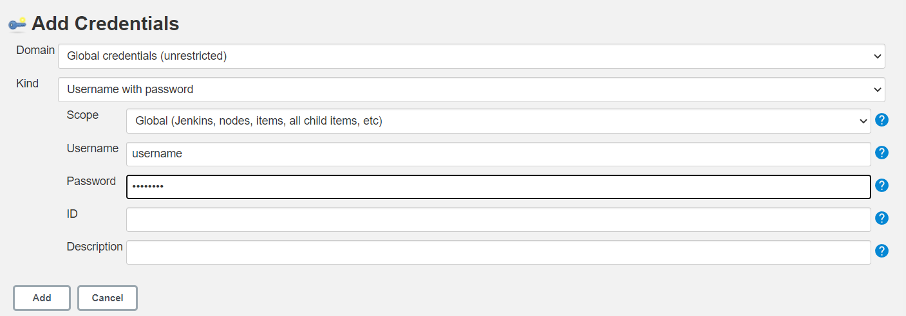

## Docker jenkins 이미지를 활용한 간단한 CI 구현

참조: [기억보단 기록을](https://jojoldu.tistory.com/139)

- jojoldu님의 블로그를 참고하여 CI를 연습한다. 내용은 방법위주로 간단하게 정리한다.
- 대부분 내용은 동일하지만 버전 등 차이가 있기 때문에 문제가 생기는 부분은 임의로 수정 및 추가하여 진행했다.
    1. Kitematic을 사용하지 않고 직접 jenkins image pull하여 수행
    2. image version → lts
    3. Github Service 설정이 deprecate됨 → Webhook 세팅으로 변경
    4. **gradlew 실행권한 설정 필수**

### Spring Project Setting


빌드 시 내역 확인을 위한 출력구문을 build.gradle에 추가한다. 이후 Github로 push 한다.

### Jenkins Docker container 설치

1. lts 버전 도커 이미지를 pull 받는다.

    

2. 컨테이너를 생성한다. (추가적으로 포트 포워딩 및 컨테이너 이름을 지정한다)

    

3. 로컬호스트 접속 후 젠킨스 세팅

    

    

4. 관리자 계정 생성

### Jenkins 설정

1. 새로운 Item 생성

    

2. 이름 지정 및 Freestyle project 선택

    

3. 소스코드 관리 탭에서 Git 선택 후 Repository / Credential 등록

    

    Branch는 master로 제한한다.

    

    Credential은 Add를 통해 등록 후 

    

    이와같이 설정 가능하다.

4. 빌드 트리거 설정

    

    Github hook 선택

5. 빌드 스크립트 작성

    

    Execute shell 선택

    

    `clean` 수행 후 `print`수행하는 스크립트 작성 (print는 초반부에 build.gradle에 작성됐다.)

    - 이미 gradlew가 Repository에 포함되어 있기 때문에 별도의 설치 필요없이 바로 빌드한다.

### Github 설정

Setting → Webhook 선택하여 Webhook을 추가한다.


여기에서 Payload URL에는 localhost를 사용할 수 없다. 이를 사용하면 Github 서버의 `localhost`로 인식하기 때문이다. 따라서 여기에서는 Jenkins가 외부 IP를 갖도록 해야한다.

#### 번외 ngrok을 이용한 포워딩

1. 운영환경에 맞는 ngrok을 다운 후 스크립트 파일 실행
2. `ngrok http '포트포워딩 대상포트'`
3. 다음과 같이 로컬호스트가 포워딩 된다. 여기에서는 9000 포트를 포워딩하였다.

    

4. Jenkins 접속 확인

    

이제 얻어진 주소를 이용하여 위의 Payload URL에 등록한다.


- jenkins 주소 뒤에 /github-webhook/을 추가한다.
- 깃허브에 푸시가 되면 해당 path로 hook을 한다.

### 빌드 테스트

빌드를 테스트하기 위해 먼저 gradlew 권한을 설정하고 commit → push 진행한다. (master)

```bash
git update-index --chmod=+x gradlew
```


위와 같이 설정된 출력 문구를 확인할 수 있다.

### Slack 연동

1. 워크스페이스 및 Jenkins 빌드 메세지를 받을 채널을 개설

    

2. Slack 플러그인 추가 `본인workspace.slack.com/apps/`

    

3. Jenkins 관리 → 플러그인 관리 → 설치 가능항목 → Slack Notification (다운후 재시작 설치 선택)
4. Jenkins 관리 → 시스템 설정 → Slack 항목의 Credential 추가

    

5. Workspace, Credential, Default channel 설정 후 적용

    

6. Notification 적용할 프로젝트 선택 → 빌드 후 조치 추가

    

    성공, 실패에 대해 Notification 한다.

### 결과

추가 커밋 시 다음과 같이 빌드 성공 메세지가 Slack의 #jenkins 채널로 전달된다.

